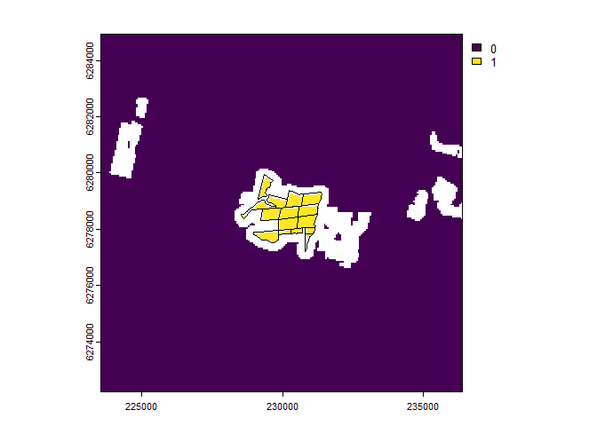
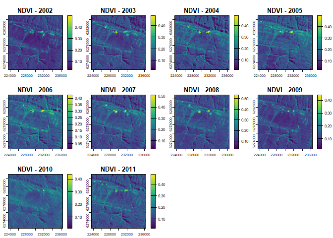
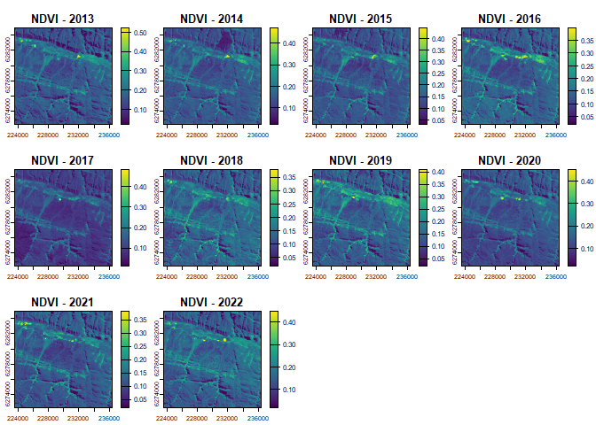
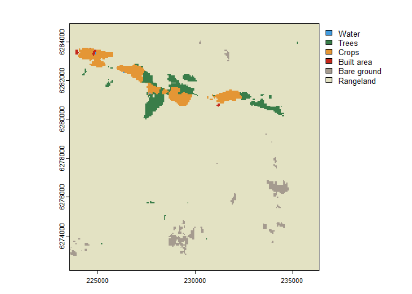

BACI evaluation Baviaanskloof
================
Jasper Van doninck, Other Authors

## Usage

### The Baviaanskloof dataset

We will use the Baviaanskloof dataset created by [del Río-Mena et al.,
2021](https://journals.plos.org/plosone/article?id=10.1371/journal.pone.0243020),
which is included in the package, to demonstrate the restoration impact
evaluation. The dataset contains the sites of large-scale spekboom
revegetation, and indicates in which year the revegetation was
undertaken. It also indicates area in which lifestock grazing exclusion
was used as a restoration activity. We here select the sites revegetated
in 2012 that were not subject to lifestock grazing exclusion to assess
the effectiveness of the revegetation actions.

``` r
library(EnvImpactEval)

data(baviaanskloof)
baviaanskloof <- unwrap(baviaanskloof)

plot(baviaanskloof, "Planting_date")
```

<!-- -->

``` r
year <- 2012
selected_sites <- baviaanskloof[baviaanskloof$Planting_date==year & baviaanskloof$Lifestock_exclusion==0]
other_sites <- baviaanskloof[baviaanskloof$Planting_date!=year | baviaanskloof$Lifestock_exclusion==1]
```

### Spatial reference and the candidate control pixels

The package requires the user to define the spatial parameters at which
the analysis will be performed. For now, only a raster-based framework
is implemented, a vector framework is planned for a future version. The
user must provide the Coordinate Reference System of the raster (by
default the UTM zone of the site’s centroid), the spatial resolution
(which is typically linked to the spatial resolution of EO datasets used
in the analysis), and the parameters that define from which area control
pixels for a control-impact or before-after-control-impact will be
selected.

We here choose to restrict the search area for potential control units
to a bounding box with a buffer of 5 km around the sites reforested in
2012. Furthermore, in order to avoid undesired effects of spatial
misregistration or adjacency effects, we exclude as control units those
pixels in a radius of 150 m around the selected impact sites. We
obviously also exclude the areas restored in the other years as control
pixels. Since we will use metrics derived from Landsat data to quantify
restoration effectiveness, we selected a corresponding spatial
resolution of 30 as the basis of our analysis. We can now plot a map
showing the impact pixels (in green), the potential control pixels (in
grey), and the excluded pixels (in white). Notice that the map shows UTM
coordinates, as this was by default selected as the Coordinate Reference
System.

``` r
refRas <- ref_rast(selected_sites, resolution=30, buffer=5000, round_coords=-2)
matchingCands <- matchCandidates(selected_sites, refRas, excludeBufferOut=150, excludeOther = other_sites)
plot(matchingCands)
selected_sites_proj <- project(selected_sites, refRas)
lines(selected_sites_proj)
```

<!-- -->

### Evaluation metric

For this example, we chose Landsat Normalized Difference Vegetation
Index (NDVI) as the metric to use in the impact evaluation. NDVI is
indicative of vegetation “greenness” and could therefore inform us
whether a large scale revegetation effort was successful. The Landsat
programme has been running for several decades and is therefore a useful
data source for impact evaluation of past interventions. Landsat data
are available from several cloud platforms. We here use Microsoft’s
Planetary Computer, which allows querying with the SpatioTemporal Asset
Catalog (STAC) language.

``` r
stac_endpoint <- as.endpoint("PlanetaryComputer")
stac_collection <- as.collection("Landsat", stac_endpoint)
```

We first create two NDVI time series, for the 10 years before and the 10
years after the restoration intervention in 2012. For this example, we
selected only images acquired in the months March to May with a cloud
cover below 60% in order to reduce processing time. Using a more
detailed time series analysis, it would be possible to describe
seasonality and select the period of highest or lowest vegetation cover.
The composite images are currently generated by selecting the median
value for each year. Additional compositing algorithms (e.g., maximum
NDVI) will be added later.

We then run a simple time series analysis on these two 10-year time
series by calculating the average value and trend over the time series.
These steps can take a few minutes.

``` r
vi_before <- eo_stac_yearly_composites(endpoint=stac_endpoint,
                                          collection=stac_collection,
                                          spatRef = refRas,
                                          years = seq(year-10, year-1, 1),
                                          months = 3:5,
                                          maxCloud=60) |>
  cubeVI(VI="MSAVI", endpoint=stac_endpoint, collection=stac_collection) |>
  gdalcube_as_terra()

vi_after <- eo_stac_yearly_composites(endpoint=stac_endpoint,
                                         collection=stac_collection,
                                         spatRef = refRas,
                                         years = seq(year+1, year+10, 1),
                                         months = 3:5,
                                         maxCloud=60) |>
  cubeVI(VI="MSAVI", endpoint=stac_endpoint, collection=stac_collection) |>
  gdalcube_as_terra()

avgtrend_before <- calc_ts_metrics(vi_before)
avgtrend_after <- calc_ts_metrics(vi_after)

plot(avgtrend_before, main=c("MSAVI average, before", "MSAVI trend, before"))
```

<!-- -->

``` r
plot(avgtrend_after, main=c("MSAVI average, after", "MSAVI trend, after"))
```

<!-- -->

### Control-impact matching

Users should specify the covariates used in the matching analysis.
Ideally, this should include “all covariates likely to impact both the
selection to the treatment and the outcome of interest” ([Schleicher et
al.](https://onlinelibrary.wiley.com/doi/abs/10.1111/cobi.13448)). For
the Baviaanskloof example, we use a limited number of matching
covariates. Because we restricted the search window for control units to
a relatively small area around the impact sites, we assume that climatic
variation will be small and mostly induced by local topography.
Topographic slope and aspect may also determine whether or not a site is
selected for revegetation or determine the success of the revegetation
intervention. We also included land cover as a matching covariate. This
will ensure that control pixel are selected from the same landcover type
(i.e. “rangeland”). Note that in the current implementation the 9-class
land use land cover layer from Impact Observatory is used. This product
is first generated for the year 2017, so we assume no change in land
cover change between the intervention year (2012) and 2017. Given that
terrain revegetated with spekboom will still be classified as
“rangeland” this is not an issue in this example, but it may be a
problem for other situations.

``` r
dem <- nasadem(refRas)
plot(dem)
```

<!-- -->

``` r
landcover <- lulc(refRas, year=year)
```

    ## Warning in lulc2rast(extent, year, endpoint = endpoint, collection =
    ## collection, : Land cover product io-lulc-9-class currently has data 2017-2022.
    ## 2017 selected.

``` r
plot(landcover)
lines(selected_sites_proj)
```

<!-- -->

In addition to topography and vegetation, we also included as matching
covariates the average and trend of the selected vegetation index in the
10-year period before the restoration intervention. This way, control
pixels will be selected that have undergone a similar temporal
trajectory as the impact pixels in the years before intervention. We
then perform the control-impact matching using propensity score matching
(default method), and select 10 control pixels for each impact pixel
with replacement (a control pixel can be paired with several impact
pixels). This step can be performed interactively by setting the
parameter , which will display matching results and plots after which
the matching can be accepted or rejected.

``` r
matchingLayers <- list(dem, landcover, avgtrend_before)
matches <- matchCI(matchingCands, rast(matchingLayers), eval=FALSE, ratio=10, replace=TRUE)
```

### Before-After-Control-Impact evaluation

To tun the BACI analysis, we first need to extract the values of the
evaluation metrics (in this case the average over the 10-year time
series before and after intervention) for the control-impact pairs
obtained in the matching. When running the BACI analysis, we specify a
spatial reference to which the pixel-based results will be written.

``` r
baci_input <- extractMatches(matches, before=subset(avgtrend_before, "average"), after=subset(avgtrend_after, "average"))
baci_results <- BACI_contrast(baci_input, SpatRef=crop(refRas, selected_sites_proj))
```

The results of the BACI analysis can be viewed by printing the
data.table associated to the output object. The data.table shows, for
each impact unit, the BACI contrast and p-values. BACI contrast values
smaller than zero indicate a positive effect of the revegetation
intervention. The BACI results can also be plotted on a map, here with
non-significant BACI contrast masked out. If desired, the pixel-based
results can now be aggregated to different spatial levels, e.g., the
revegetation site.

``` r
baci_results$data
```

    ##       subclass       x        y     contrast      p_value
    ##    1:        1 2473235 -3922765  0.002317976 2.841795e-01
    ##    2:        2 2473265 -3922765 -0.002227875 4.232230e-01
    ##    3:        3 2473235 -3922795  0.001621694 5.615199e-01
    ##    4:        4 2473265 -3922795 -0.001189708 2.674246e-01
    ##    5:        5 2473295 -3922795 -0.002218703 3.072845e-01
    ##   ---                                                    
    ## 3660:     3660 2474105 -3925795 -0.004423036 3.265419e-02
    ## 3661:     3661 2474135 -3925795 -0.009847973 2.260668e-06
    ## 3662:     3662 2474075 -3925825 -0.001076233 3.547740e-01
    ## 3663:     3663 2474105 -3925825 -0.007306430 1.245733e-03
    ## 3664:     3664 2474075 -3925855 -0.007543830 5.441353e-04

``` r
plot(baci_results$spat["contrast"], 
     range=baci_results$spat["contrast"] |> minmax() |> abs() |> max() |> rep(2)*c(-1,1), 
     col=hcl.colors(50, palette = "RdYlBu", rev = TRUE))
plot(as.numeric(baci_results$spat["p_value"]<0.05), 
     col=data.frame(value=c(0,1), color=c("grey95", NA)), 
     add=TRUE, 
     legend=FALSE)
lines(selected_sites_proj)
```

<!-- -->
